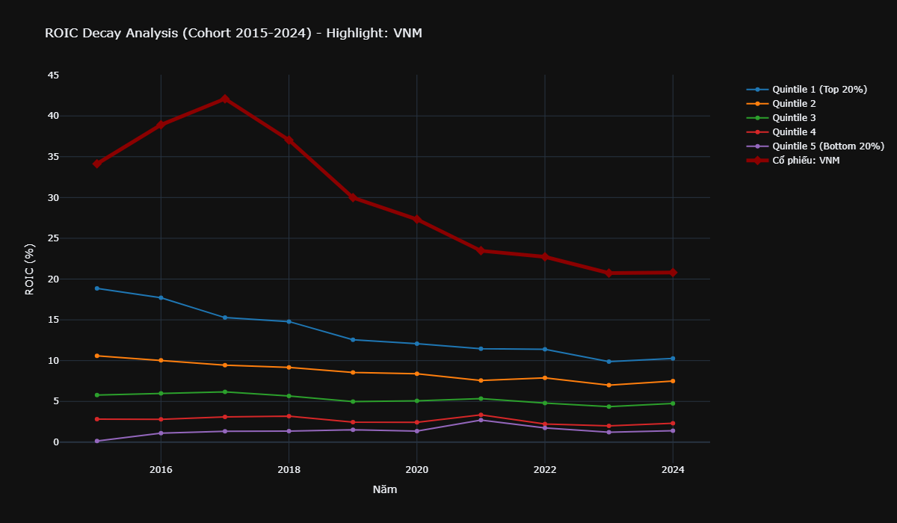
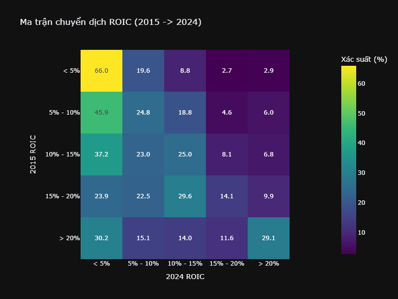
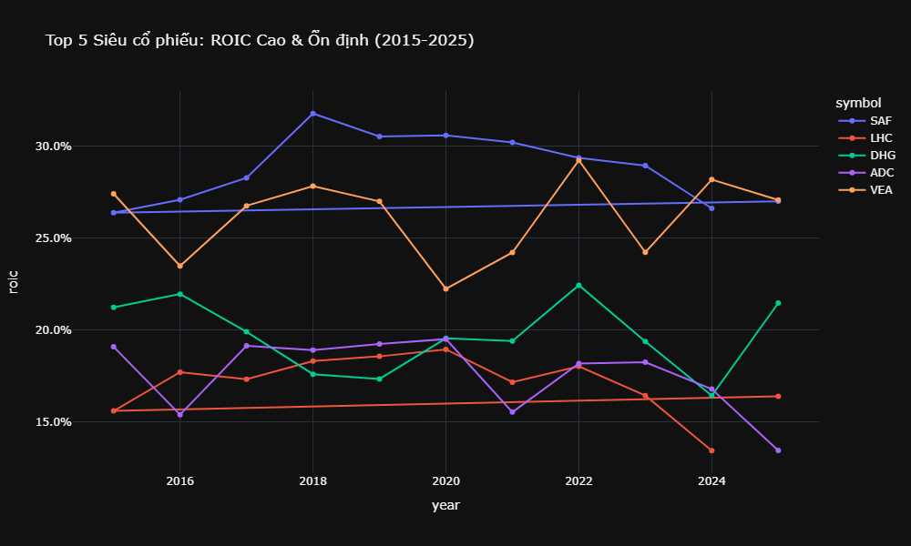

# Báo cáo Phân tích ROIC Chuyên sâu (McKinsey Style)

Báo cáo này tập trung vào hiệu quả sử dụng vốn (ROIC) của các doanh nghiệp phi tài chính trên thị trường chứng khoán Việt Nam giai đoạn 2015 - 2024.

## 1. Phân tích Độ lệch ROIC (ROIC Decay)
Biểu đồ dưới đây minh họa xu hướng hội tụ về mức trung bình của ROIC. Các doanh nghiệp được chia thành 5 nhóm dựa trên ROIC năm 2015.
- **Nhóm 1 (Top 20%):** Thường có xu hướng giảm dần biên lợi nhuận do cạnh tranh (Decay).
- **Nhóm 5 (Bottom 20%):** Có xu hướng cải thiện hoặc rời bỏ thị trường.

*Nhận định:* Thị trường Việt Nam cho thấy sức mạnh của sự hội tụ, tuy nhiên có những doanh nghiệp đầu ngành (như HPG) duy trì được ROIC cao hơn trung bình ngành trong thời gian dài nhờ lợi thế quy mô.

## 2. Ma trận Chuyển dịch (Transition Matrix)
Ma trận này đo lường xác suất một doanh nghiệp duy trì được "phong độ" ROIC sau 10 năm.

- **Độ ổn định:** Các doanh nghiệp có ROIC > 20% năm 2015 có xác suất cao duy trì được vị thế dẫn đầu.
- **Bẫy thu nhập thấp:** Các doanh nghiệp ROIC < 5% rất khó để thoát lên các nhóm trên 15%.

## 3. Top 5 Siêu cổ phiếu (Alpha Screener)
Dựa trên tiêu chí: **ROIC trung bình 10 năm > 15%** và **Độ lệch chuẩn thấp (Ổn định cao)**.

| Mã CP | ROIC Trung bình | Độ biến động (CV) | Đặc điểm |
|-------|-----------------|-------------------|----------|
| **SAF** | 28.97% | 6.4% | Lương thực, thực phẩm - Cực kỳ ổn định |
| **ADC** | 17.99% | 8.6% | Sách & Thiết bị trường học |
| **HRB** | 15.40% | 8.8% | Bia Sài Gòn - Bình Tây |
| **VEA** | 26.05% | 8.9% | Động cơ & Máy nông nghiệp - Cổ tức cao |
| **LHC** | 17.15% | 9.6% | Thủy điện & Khoáng sản |

## 4. Kết luận & Khuyến nghị
- Các nhà đầu tư giá trị nên tập trung vào nhóm **ROIC bền vững** thay vì các nhóm có ROIC đột biến trong ngắn hạn.
- Những mã như **VEA** và **SAF** là minh chứng cho việc duy trì lợi thế cạnh tranh bền vững tại Việt Nam.
